<picture>
  <source media="(prefers-color-scheme: dark)" srcset="./assets/dark/hero.svg">
  
</picture>

  
  
  
  
  

I'm a final-year B.Tech student at **LNMIIT Jaipur** who builds backend services in **Java / Spring Boot** and **Python / FastAPI**, with **React / Next.js** frontends. I focus on systems that stay correct under load — event-driven pipelines on Kafka, Redis and PostgreSQL — and on AI features that are grounded in evidence rather than guesswork. Both of my main projects are deployed and running on AWS.

### Impact at a glance

<picture>
  <source media="(prefers-color-scheme: dark)" srcset="./assets/dark/metrics.svg">
  
</picture>

### Featured projects

<a href="https://pulseops.atlas-theproject.duckdns.org">
<picture>
  <source media="(prefers-color-scheme: dark)" srcset="./assets/dark/card-pulseops.svg">
  
</picture>
</a>

**[Live demo →](https://pulseops.atlas-theproject.duckdns.org)** &nbsp;·&nbsp; **[Source code](https://github.com/mahendraaravind13-creator/pulseops)**

 

<a href="https://atlas-theproject.duckdns.org">
<picture>
  <source media="(prefers-color-scheme: dark)" srcset="./assets/dark/card-atlas.svg">
  
</picture>
</a>

**[Live demo →](https://atlas-theproject.duckdns.org)** &nbsp;·&nbsp; **[Source code](https://github.com/mahendraaravind13-creator/project-Atlas)**

 

<a href="https://github.com/mahendraaravind13-creator/uav-isac-milp-cnn-lstm-">
<picture>
  <source media="(prefers-color-scheme: dark)" srcset="./assets/dark/card-uav.svg">
  
</picture>
</a>

**[Research repository →](https://github.com/mahendraaravind13-creator/uav-isac-milp-cnn-lstm-)**

### Tech stack

<picture>
  <source media="(prefers-color-scheme: dark)" srcset="./assets/dark/stack.svg">
  
</picture>

### Experience & achievements

<picture>
  <source media="(prefers-color-scheme: dark)" srcset="./assets/dark/timeline.svg">
  
</picture>

### Get in touch

I'm open to **software engineering roles** in backend, full-stack and applied AI.
Reach me at **[mahendraaravind13@gmail.com](mailto:mahendraaravind13@gmail.com)** or on **[LinkedIn](https://www.linkedin.com/in/mahendra-aravind-128a0a28a/)**.
