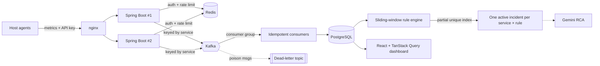
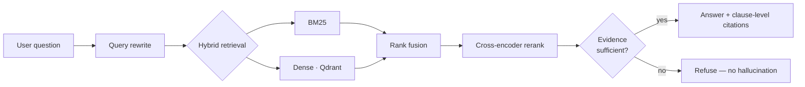

<!-- ═══════════════════════════════ HEADER ═══════════════════════════════ -->
<p align="center">
  
</p>

<p align="center">
  <a href="https://github.com/mahendraaravind13-creator">
    
  </a>
</p>

<p align="center">
  <a href="https://www.linkedin.com/in/mahendra-aravind-128a0a28a/"></a>
  <a href="mailto:mahendraaravind13@gmail.com"></a>
  <a href="https://leetcode.com/u/snipo"></a>
  <a href="https://github.com/mahendraaravind13-creator"></a>
  
</p>

<!-- ═══════════════════════════════ WHOAMI ═══════════════════════════════ -->

```ts
// ~/aravind/whoami.ts
const aravind = {
  role:       "Full-Stack Engineer · Applied AI Systems",
  education:  "B.Tech Communication & Computer Engineering @ LNMIIT Jaipur (2023 → 2027)",
  location:   "India 🇮🇳",
  builds:     ["multi-tenant, event-driven backends", "grounded RAG platforms", "ML that imitates optimisers"],
  core:       { backend: ["Java", "Spring Boot", "FastAPI"], data: ["Kafka", "Redis", "PostgreSQL", "Qdrant"], ui: ["React", "Next.js"] },
  shipped:    "Live on AWS EC2 via GitHub Actions CI/CD",
  research:   "Conv3D-LSTM for UAV ISAC scheduling → manuscript for IEEE VTC",
  teaching:   "TA, AI & ML — mentored 80+ students (Jan–May 2026)",
  offTheClock:"Carnatic violinist · 10+ years of formal training 🎻",
  status:     "OPEN_TO_SDE_ROLES",
} as const;
```

<!-- ═══════════════════════════════ METRICS ═══════════════════════════════ -->

<h2 align="center">⚡ SIGNAL // NOISE</h2>

<table align="center">
  <tr>
    <td align="center" width="160"><h3>70ms → 0.3ms</h3><sub>window query on 2M rows<br/><b>PulseOps</b></sub></td>
    <td align="center" width="160"><h3>30 / 30</h3><sub>requests served with a<br/>replica down <b>PulseOps</b></sub></td>
    <td align="center" width="160"><h3>MRR 0.75</h3><sub>vs 0.63 baseline RAG<br/><b>Atlas</b></sub></td>
    <td align="center" width="160"><h3>2.6× fewer</h3><sub>input tokens per answer<br/><b>Atlas</b></sub></td>
  </tr>
  <tr>
    <td align="center"><h3>244</h3><sub>automated tests<br/><b>Atlas</b> (222 BE + 22 FE)</sub></td>
    <td align="center"><h3>92.9%</h3><sub>per-waypoint accuracy<br/><b>UAV ISAC</b></sub></td>
    <td align="center"><h3>1M+ rows</h3><sub>MILP-labelled data<br/><b>UAV ISAC</b></sub></td>
    <td align="center"><h3>1000+</h3><sub>LeetCode solved<br/>rating 1850+</sub></td>
  </tr>
</table>

<!-- ═══════════════════════════════ PROJECTS ═══════════════════════════════ -->

<h2 align="center">🛰️ FEATURED BUILDS</h2>

---

### 🟣 PulseOps — Multi-Tenant Monitoring & Incident Management

<p>
  <a href="https://pulseops.atlas-theproject.duckdns.org"></a>
  <a href="https://github.com/mahendraaravind13-creator/pulseops"></a>
</p>


Agents push host metrics → server-side alert rules evaluate them over sliding windows → incidents **open, deduplicate and auto-resolve** themselves, with Gemini root-cause suggestions kept off the critical path.



- **Race-free dedup** — a PostgreSQL partial unique index guarantees one active incident per service × rule across instances; optimistic locking blocks lost updates.
- **Kafka pipeline** — partition keys for per-service ordering, consumer groups, dead-letter topic, idempotent consumers.
- **Fast** — composite index cut rule-window queries from **69.8 ms → 0.29 ms** on 2M rows.
- **Resilient** — 2 stateless replicas behind nginx; **30/30** requests served with one down.
- **Tested** — 37 tests incl. Testcontainers integration tests in GitHub Actions CI.
- **Dashboard** — 7 auth-guarded pages, 15 s live polling, optimistic updates with rollback.

---

### 🔵 Project Atlas — AI Project Intelligence Platform (Grounded RAG)

<p>
  <a href="https://atlas-theproject.duckdns.org"></a>
  <a href="https://github.com/mahendraaravind13-creator/project-Atlas"></a>
  
</p>


Traces every specification deviation through its downstream impact on **procurement, schedule and commissioning** — and cites the evidence down to document, page and clause.



- **Retrieval** — **Recall@12 1.0** and **MRR 0.75** (baseline RAG 0.63) on 16 held-out questions using **2.6× fewer input tokens**.
- **Deterministic engines** — compliance, CPM schedule and commissioning: **F1 1.0** on 12 labelled cases, **schedule MAE 1.5 days**, **21/21** steps auto-evaluated.
- **Secure backend** — layered FastAPI services, project-scoped RBAC (3 roles), scrypt-hashed passwords, HMAC-signed tokens, SQLAlchemy/Alembic on PostgreSQL.
- **Shipped** — API, Next.js/TypeScript dashboard, PostgreSQL and Qdrant on AWS EC2 via Docker Compose + Caddy TLS, deployed by GitHub Actions.
- **Tested** — 222 backend + 22 frontend tests and a reproducible evaluation suite.

---

### 🟢 UAV ISAC Scheduling — Learning a MILP Optimiser *(Research)*

<p>
  <a href="https://github.com/mahendraaravind13-creator/uav-isac-milp-cnn-lstm-"></a>
  
</p>


A 3-branch **Conv3D-LSTM** that imitates a MILP in a single forward pass — deciding at each of 15 waypoints whether a UAV **senses, communicates, or does both**.

| Metric | CNN baseline | **Conv3D-LSTM** |
|:--|:--:|:--:|
| Per-waypoint test accuracy (60,690 unseen trajectories) | 86.5% | **92.9%** |
| Joint-ISAC recall | 41% | **75%** |
| Training data | — | **66K+ trajectories · 1M+ rows** |

Sensing (Cramér–Rao bound) and communication CDFs closely track the MILP optimum.

<!-- ═══════════════════════════════ STACK ═══════════════════════════════ -->

<h2 align="center">🧬 TECH MATRIX</h2>

<p align="center">
  <br/>
  <br/>
  <br/>
  <br/>
  
</p>

<table align="center">
  <tr><td><b>⚙️ Backend</b></td><td>Spring Boot · Spring Security · Hibernate/JPA · FastAPI · SQLAlchemy · REST · JWT · RBAC</td></tr>
  <tr><td><b>🗄️ Data & Messaging</b></td><td>PostgreSQL · Flyway · Alembic · Redis · Apache Kafka · Qdrant</td></tr>
  <tr><td><b>🧠 AI / ML</b></td><td>RAG · LangGraph · Hybrid BM25 + dense retrieval · Reranking · Gemini & Groq APIs · TensorFlow/Keras · scikit-learn · pandas</td></tr>
  <tr><td><b>🎨 Frontend</b></td><td>React · Next.js · TanStack Query · React Router · Tailwind CSS</td></tr>
  <tr><td><b>🚀 Deploy & DevOps</b></td><td>AWS EC2 · Docker & Compose · nginx · Caddy · GitHub Actions · Testcontainers</td></tr>
</table>

<!-- ═══════════════════════════════ LIVE STATS ═══════════════════════════════ -->

<h2 align="center">📡 TELEMETRY</h2>

<p align="center">
  
  
</p>

<p align="center">
  
</p>

<!-- ═══════════════════════════════ LOG ═══════════════════════════════ -->

<h2 align="center">🏆 ACHIEVEMENT LOG</h2>

```diff
+ 2026  Finalist — Economic Times AI Hackathon 2.0 (Project Atlas)
+ 2026  Teaching Assistant — AI & ML, LNMIIT · mentored 80+ students
+ 2026  Claude 101 certification — Anthropic Academy
+ ----  Research Intern — Learning-based ISAC scheduling for UAVs · manuscript for IEEE VTC
+ ----  1,000+ LeetCode problems · contest rating 1,850+
+ 2023  JEE Main — 96.7 percentile
```

<!-- ═══════════════════════════════ FOOTER ═══════════════════════════════ -->

<p align="center">
  
</p>

<p align="center">
  
</p>
