<h3>I build the backend systems and AI tools that apps run on — and ship them live.</h3>

Final-year engineering student @ LNMIIT Jaipur · 2 live products on AWS · published-track AI research · hackathon finalist

  

  

  

  

 

